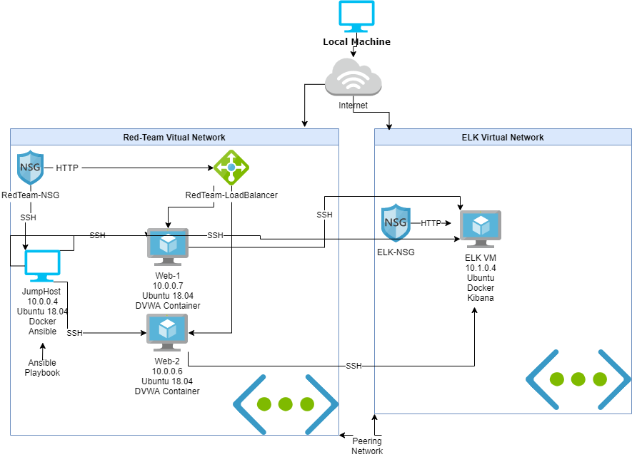

## Automated ELK Stack Deployment

The files in this repository were used to configure the network depicted below.

These files have been tested and used to generate a live ELK deployment on Azure. They can be used to either recreate the entire deployment pictured above. Alternatively, select portions of the playbook file may be used to install only certain pieces of it, such as Filebeat.

  - [Install-ELK.yml](/Playbooks/Install-ELK.yml/)

This document contains the following details:
- Description of the Topologu
- Access Policies
- ELK Configuration
  - Beats in Use
  - Machines Being Monitored
- How to Use the Ansible Build

### Description of the Topology

The main purpose of this network is to expose a load-balanced and monitored instance of DVWA, the D*mn Vulnerable Web Application.

Load balancing ensures that the application will be highly accessible, in addition to restricting entry to the network.
- Load Balancing protects the network from dos (Denial of service) attacks that would otherwise render networks down. As the name suggests Load Balancing helps distribute the weight of incoming traffic to the virtual network. Also, a Load Balancer will deny traffic from unwanted or unknown sources. A jump box machine helps manage servers or machines under it with ease, jump box helps with container distribution. 

Integrating an ELK server allows users to easily monitor the vulnerable VMs for changes to the files and system metrics.
- filebeat checks for changes in files/ collects log events and sends them to ELK server.
- Metricbeat checks metrics from OS or services running on a network. Sends data to ELK server.

The configuration details of each machine may be found below.

| Name     | Function | IP Address | Operating System |
|----------|----------|------------|------------------|
| Jump Box | Gateway and Ansible  | 10.0.0.4   | Linux            |
| Web-1     |     DVWA server     |      10.0.0.7      | Linux            |
| Web-2     |   Backup DVWA server       |   10.0.0.6         | Linux            |
| ELK-VM     |  ELK stack container        |      10.1.0.4      | Linux            |

### Access Policies

The machines on the internal network are not exposed to the public Internet. 

Only the JumpBox machine can accept connections from the Internet. Access to this machine is only allowed from the following IP addresses:
- 98.523.64.64

Machines within the network can only be accessed by JumpBox.
- The only machine with access to ELK server is the Jumpbox. the ip address is 10.0.0.4

A summary of the access policies in place can be found in the table below.

| Name     | Publicly Accessible | Allowed IP Addresses |
|----------|---------------------|----------------------|
| Jump Box | Yes              | Home IP    |
|      Web-1    |      No               |       10.0.0.4               |
|  Web-2        |   No                  |       10.0.0.4               |
|ELK-VM| No| 10.0.0.4
### Elk Configuration

Ansible was used to automate configuration of the ELK machine. No configuration was performed manually, which is advantageous because...
- Ansible allows for mutliple deployment of services or containers with a single script or .yml playbook. All at once instead of individually.

The playbook implements the following tasks:
- Install Docker.io
- Install Pip
- Install Python-pip
- Install docker container
- Install and deploy ELK
- Run various commands to aid in the efficiency of machines.

The following screenshot displays the result of running `docker ps` after successfully configuring the ELK instance.

### Target Machines & Beats
This ELK server is configured to monitor the following machines:
- Web-1 (10.0.0.7), Web-2 (10.0.0.6)

We have installed the following Beats on these machines:
- Filebeat
- Metricbeat

These Beats allow us to collect the following information from each machine:
- filebeat checks for changes in files/ collects log events and sends them to ELK server. Example is log file changes being sent as log events.
- Metricbeat checks metrics from OS or services running on a network. Sends data to ELK server. Example of metric beat is gathering info on incoming traffic by OS such as Windows, Linux or IOS traffic.

### Using the Playbook
In order to use the playbook, you will need to have an Ansible control node already configured. Assuming you have such a control node provisioned: 

SSH into the control node and follow the steps below:
- Copy the filebeat-playbook.yml and metricbeat-playbook.yml file to /etc/ansible/roles
- Update the /ansible/hosts/ file to include groups; `webservers` and `elk` with VM's IP's.  
- Run the playbook, and navigate to ELK server to check that the installation worked as expected.

Note: The filebeat and metricbeat playbook follow the same steps above.

- _Which file is the playbook? Where do you copy it?_ a playbook is a .yml file, which is copied to ansible directory; /roles/
- _Which file do you update to make Ansible run the playbook on a specific machine? How do I specify which machine to install the ELK server on versus which to install Filebeat on?_ file to update are hosts and .config in ansible directory. in the hosts file you specify which groups are under and then specify in playbook the group. 
- _Which URL do you navigate to in order to check that the ELK server is running? http://20.62.161.167:5601/app/kibana#/home
